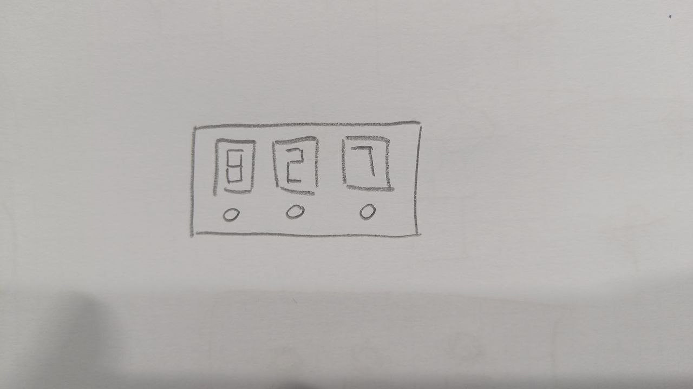
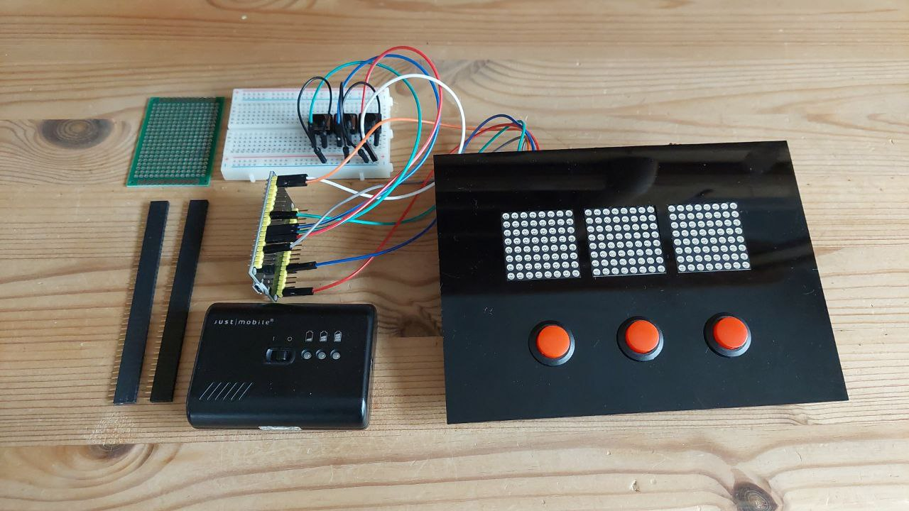
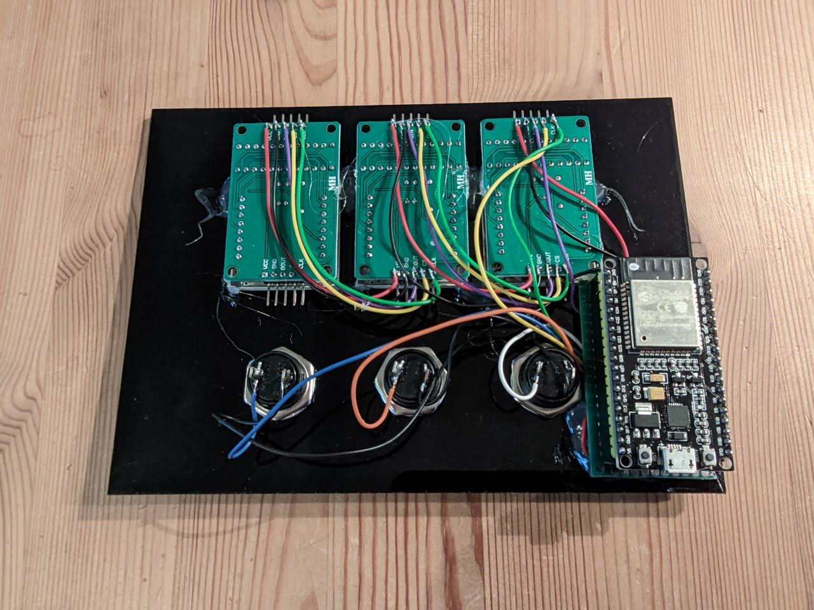
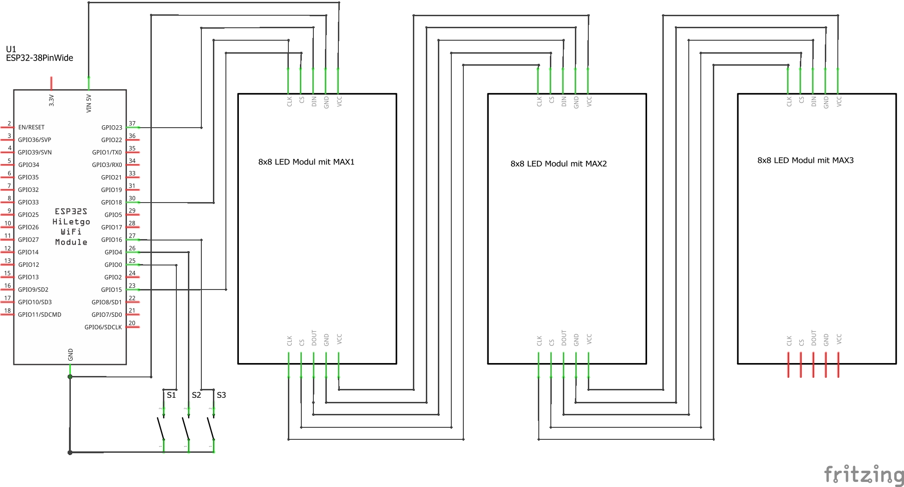
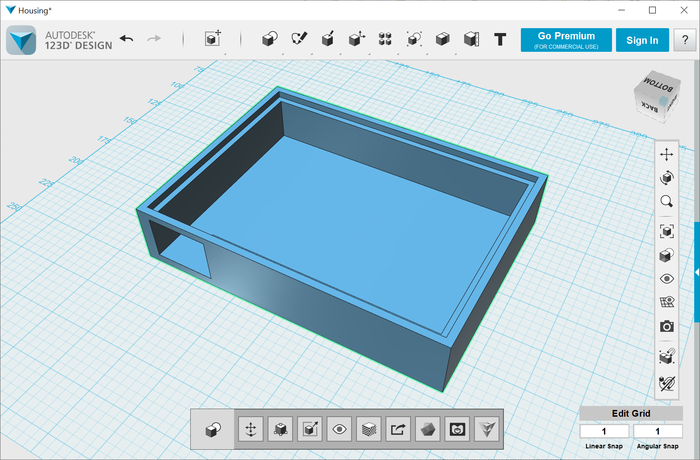

## Led matrix display with buttons
   **A simple display with 3 8x8 LED Matrix displays and with 3 buttons for iterating numbers.

### Disclaimer
   I don't take any responsibility nor liability for using this software nor for the 
   installation or any tips, advice, videos, etc. given by any member of this site or any related site.  
   Attention this plant is in the making and not yet tested.
   In particular, the behavior in summer months and the interaction with the batteries has not yet been tested by me
   extensively tested in practice. 

### Description
   The whole project description
   

   First version
   

   Back
   

### Circuit
   Circuit diagram with pictures of the components   
   

### Housing
   

### Shopping list

|Label |Price / unit |Sample URL |
|------|------|-----------|
|3 x MAX7219 8x8 Dot Matrix | 13€ | https://www.amazon.de/gp/product/B07HPD2R1H/ref=ppx_yo_dt_b_asin_title_o02_s00?ie=UTF8&psc=1 |
|3 x Button | 8€ (15 pices) | https://www.amazon.de/gp/product/B07N1N1T7R/ref=ppx_yo_dt_b_asin_title_o03_s00?ie=UTF8&psc=1 |

Additionally plexiglass for the front panel for lasering and filament for the 3D printer

### License
   This program is licensed under GPL-3.0

### Thanks

* https://www.az-delivery.de  
  *Many thanks to AZDelivery for the great modules and libraries**
* https://www.arduino.cc  
  *Thanks to the Arduino community with all its incredible possibilities and support.** 
* http://fritzing.org/home  
  *Thanks to the fritzing team for this very intuitive usable software.* 

